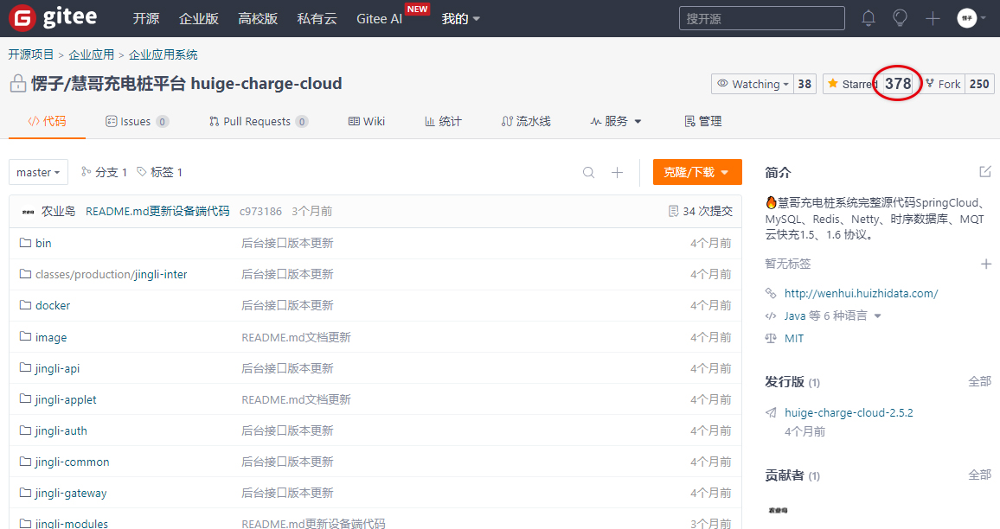
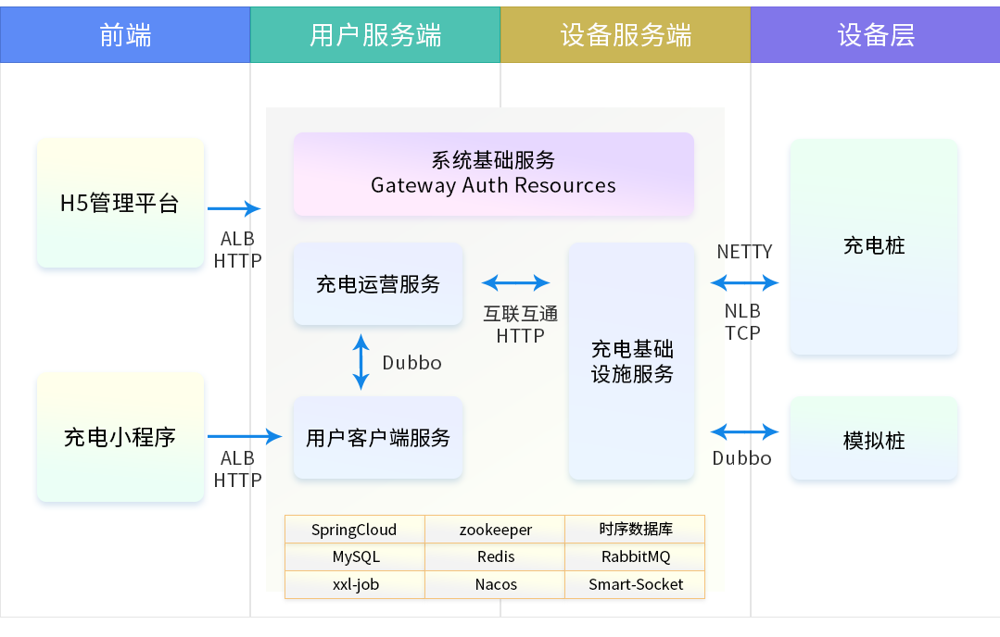
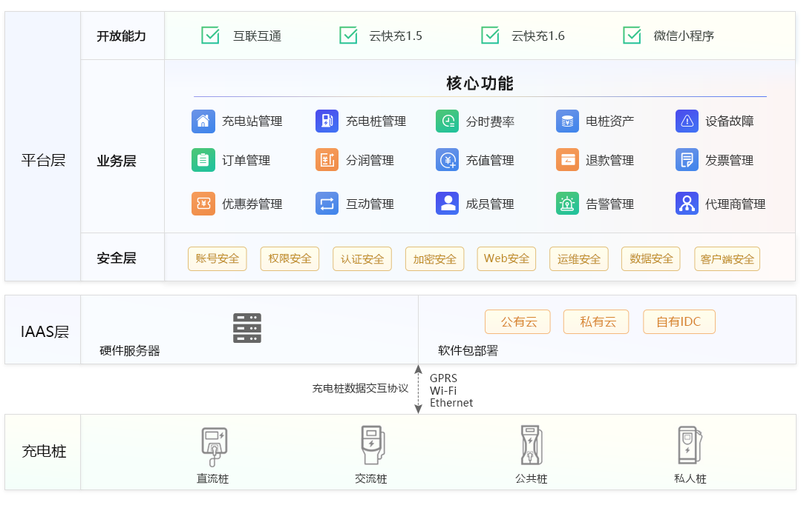
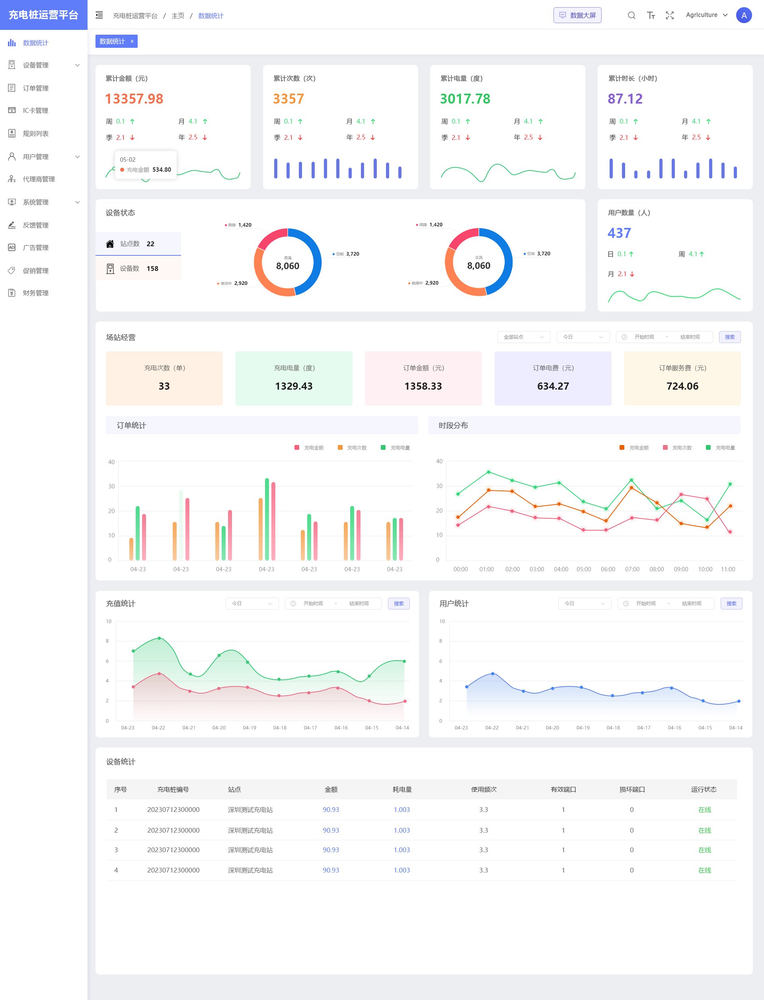
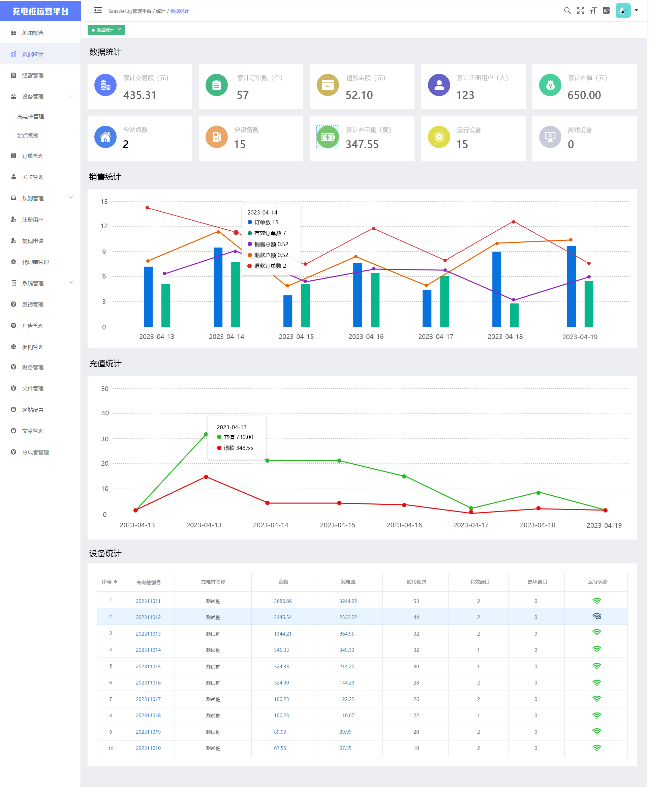
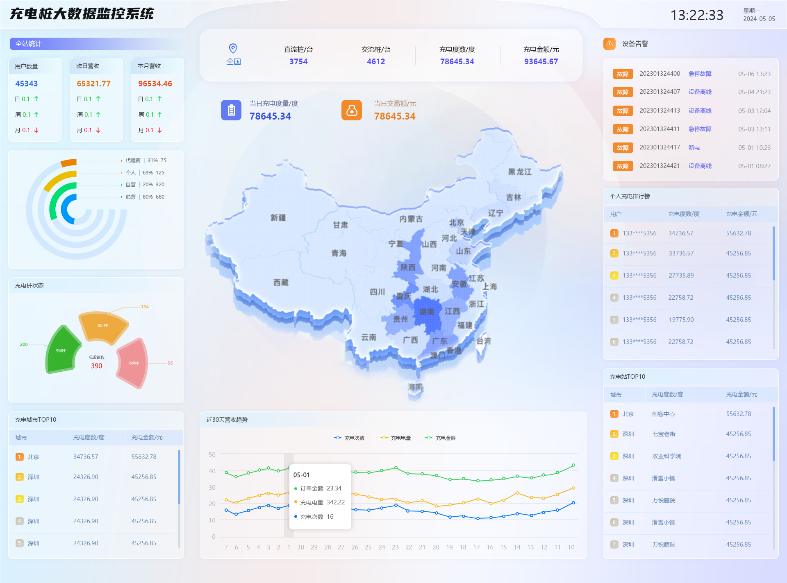
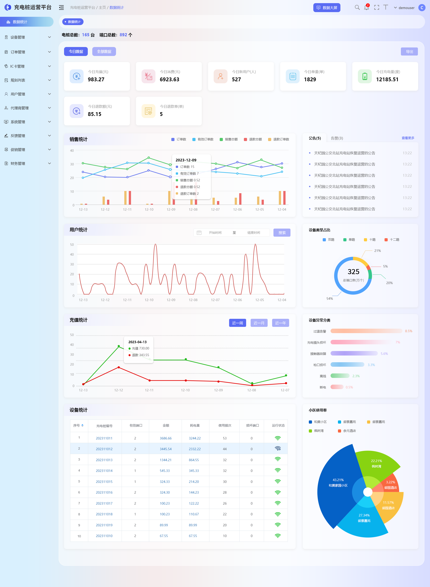
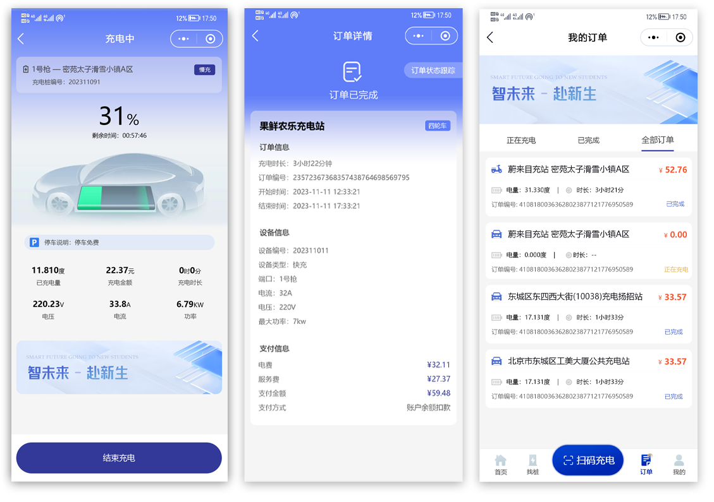
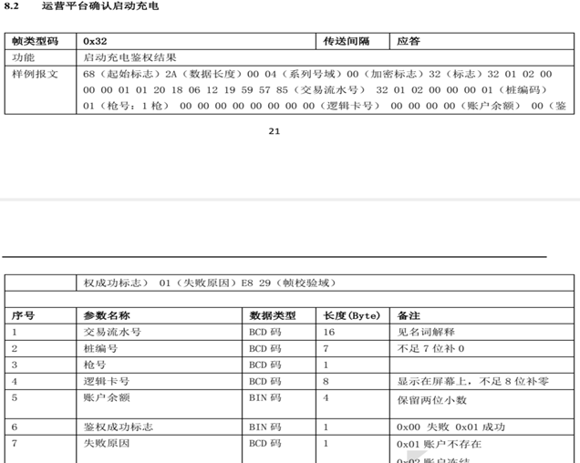
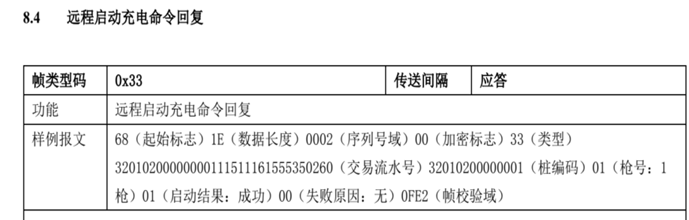

[🔥 Github的代码优先于Gitee   https://github.com/roinli/huige-ChargeOS-cloud](https://github.com/roinli/huige-ChargeOS-cloud)


当前版本：V2.5.2
   
[🔥 充电平台微服务源码](https://github.com/roinli/huige-ChargeOS-cloud)（当前）
   
[🔥 充电管理后台前端源码](https://github.com/roinli/huige-ChargeOS-cloud/tree/master/jingli-ui)
   
[🔥 充电小程序源码](https://github.com/roinli/huige-ChargeOS-cloud/tree/master/jingli-inter) 


<div align="center">

##   慧知开源充电桩平台

</div>

<div align="center" >
    <a href="http://wenhui.huizhidata.com">
        
    </a>
    <a href="http://wenhui.huizhidata.com">
        
    </a>
     <a href="https://github.com/roinli/huige-ChargeOS-cloud/repository/archive/master.zip">
        
    </a>
</div>

#### 

<div align="center">

[官网](http://wenhui.huizhidata.com/) |
[四轮在线体验](http://new-four-admin.nxptdn.com:9251/) |
[二轮在线体验](http://39.98.222.58:9252/#/login?redirect=%2Fhome) |
[帮助文档](http://wenhui..com/page/link) |

[comment]: <> ([宽屏预览]&#40;https://github.com/roinli/huige-ChargeOS-cloud/blob/master/README.md&#41;)

</div>
<div align="center" >
<a href="https://github.com/roinli/huige-ChargeOS-cloud/blob/master/README.md">宽屏预览</a>
</div>


---


### 📋 更新说明

```
v5.2.0 更新说明【更新时间2023年11月22日】
1、全面拥抱微服务| || 支持多租户 |
2、全面拥抱引入时序数据库 
3、支持互联互通 
4、支持多租户 

v5.1.0 更新说明【更新时间2023年07月10日】
1、支持分账功能 
2、支持尖峰平谷
3、支持提现功能
4、设备监控预警
```
### 用心做开源，我们也很需要你的鼓励！右上角Star🌟，等你点亮！

---

### 📝 介绍
慧知充电桩开源系统是一款全开源可商用的系统，前后端分离开发，全部100%开源，在小程序、公众号、H5、APP、PC端都能用，使用方便，二开方便！安装使用也很简单！使用文档、接口文档、数据字典、二开文档、视频教程，各种资料应有尽有，就算你是技术小白，也能轻松上手！

欢迎大家来体验、来提建议，来一起让充电桩开源物联网系统更强大，让更多开发者受益！虽然是开源，但我们该有的功能全都有！

   


#### 🖥 加群+v:18601938676（如果您也对开源感兴趣，欢迎加入群），开源、共享、共赢永远是主旋律。


---

###  📖 业务交互图




---

### 📱  系统亮点


#### 1.支持云快充1.5/1.6  |支持分账功能  | 支持尖峰平谷
#### 2.支持提现功能 | 设备监控预警 | 支持互联互通 
#### 3.全面拥抱微服务| 支持多租户 | 全面拥抱引入时序数据库 
#### 4.采用SpringCloud、SpringBoot+Mysql+Redis+高并发硬件方案

~~~
1.前后端分离：后端SpringCloud，管理端vue-admin-element，移动端Uni-app；
2.代码规范：遵循PSR-2命名规范、Restful标准接口、代码严格分层、注释齐全、统一错误码；
3.权限管理：内置强大灵活的权限管理，可以控制到每一个菜单；
4.快速上手：详细帮助文档、后台接口管理、后台数据库字典、系统文件管理备注、代码注释、一键安装；
5.系统安全：系统操作日志、系统生产日志、文件校验、数据备份；
6.高 性 能：支持Redis缓存、队列、长连接、多种云储存、支持集群部署。

~~~

#### 📖 支持云快充协议
~~~
1.遵循国标：本协议规定了充电桩与云快充平台之间数据交互的流程、格式和内容。
协议整体依据国网 104 充电桩 规约，
新增数据部分协议参照 GBT-27930 对充电桩充电过程中与云快充电平台的交互数据进行了补充，
本协议适用于交直流，交流在本协议中部分数据无需上送数据项在下面协议部分均有标注。

2.通讯方式：充电桩和充电运营管理系统之间的通信接口采用基于 TCP/IP Socket 
的通信方式实现， 按照长连接 工作模式。
两个系统可部署在同一个或者不同的企业网络环境中，
可以通过局域网或者互联网实现互相连接通信。
充电桩通信联接方式支持有线网络接口、无线 GPRS 连接运营平台服务器或者多个充电桩经过集中器 与运营平台连接。
充电桩支持服务器的直接IP地址与网络域名解析,
地址与连接端口均为可设置参数,测试服务器地址 为 121.199.192.223，端口号为 8768。

~~~

#### 📖 支持中电联互联互通协议

~~~
- T／CEC 102.1—2016 电动汽车充换电服务信息交换 第1部分：总则
- T／CEC 102.2—2016 电动汽车充换电服务信息交换 第2部分：公共信息交换规范
- T／CEC 102.3—2016 电动汽车充换电服务信息交换 第3部分：业务信息交换规范
- T／CEC 102.4—2016 电动汽车充换电服务信息交换 第4部分：数据传输及安全
~~~


### 🖥 运行环境

```
MQ
Netty
JDK1.8
SrpingCloud
MySQL 5.7 ～ 8.0
Redis

```


###  📱 系统演示


四轮管理后台： http://new-four-admin.nxptdn.com:9251/

账号：demo1010 密码：admin123456

小程序端：


二轮管理后台：http://39.98.222.58:9252/#/login?redirect=%2Fhome

账号：demo1 密码：admin123456


---


###  🔐 安装教程(如何安装部署)

想要快速安装，教程来助攻！<a href="http://wenhui.huizhidata.com/page/link" target="_blank">请参考每个工程都有READEME.md文档（详细部署文档）  查看安装教程！</a>


---

###  📲 核心功能





---

###  📖 UI界面展示











---

###  📖 支持直流交流（云快充1.6/1.5）





---


###  📻 感谢参与开发者
#### 感谢大神们提交代码（排名不分先后）
文哥、小兵、亮亮、喜峰、周强、单单

欢迎<a href="https://github.com/roinli/huige-ChargeOS-cloud/issues" target="_blank">反馈问题</a>

欢迎<a href="https://github.com/roinli/huige-ChargeOS-cloud/issues" target="_blank">提交代码</a>

---
###  📸 特别鸣谢
排名不分先后，感谢这些软件的开发者：java、springcloud、vue、mysql、redis、uniapp、echarts、时序数据库、netty、mq、硬件通讯协议 等，如有遗漏请联系我！

---
###  🎬 核心开发团队
产品：周立

技术：文哥、小兵、亮亮、喜峰、周强、单单、于强、明哥、小杨

UI：ZLY、ZMD

测试：冬天、蜗牛、小强

硬件：亮、峰哥


---
###  📺 使用须知
1、允许用于个人学习、毕业设计、教学案例、公益事业、商业使用；

2、如果商用必须保留版权信息，请自觉遵守；

3、禁止将本项目的代码和资源进行任何形式的出售，产生的一切任何后果责任由侵权者自负。


---
###  💾 版权信息

本项目包含的第三方源码和二进制文件之版权信息另行标注。

版权所有Copyright © 2017-2023 by JINGLI (http://wenhui.huizhidata.com)

All rights reserved。


---

[返回顶部 :fa-arrow-circle-up: ](https://github.com/roinli/huige-ChargeOS-cloud)

